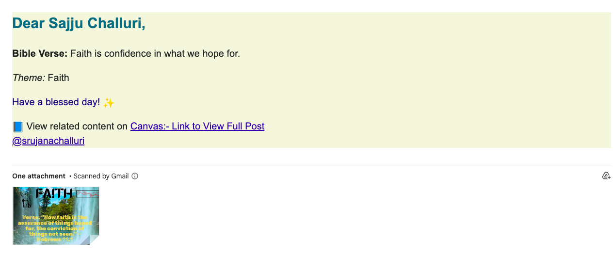

# 📬 Faith Email Automation

A Python-based automated email system that sends daily Bible verses and reflections using formatted HTML templates.

> ✝️ Built with purpose — to inspire and uplift through Scripture using technology.

---

## ✨ Features

- ⏰ Automatically sends daily devotional emails
- 📖 Includes a Bible verse, reflection, and image
- 💌 Sends responsive HTML email with embedded styling
- 🧠 Integrates CSV/Excel file to manage content
- 🛠 Scheduled using cron or Task Scheduler

---

## 🛠 Tech Stack

- **Language:** Python 3.x
- **Libraries:**  
  - `pandas` – for reading verse CSV  
  - `smtplib`, `ssl` – for secure email sending  
  - `email.mime` – to format HTML emails  
- **Email Template:** Custom HTML + inline CSS  
- **Scheduler:** Crontab (Linux/macOS) or Task Scheduler (Windows)

---

## 📁 Folder Structure

faith_email_automation/
├── email_sender.py # Main script to send email
├── faith_email_verses.csv # Source content (verse + reflection)
├── template.html # Email HTML template
├── .gitignore
├── cronlog.txt # (Optional) Output log from scheduler
└── README.md

---

## 🚀 Setup Instructions

1. **Clone the repository**
bash
  git clone https://github.com/YOUR-USERNAME/faith_email_automation.git
  cd faith_email_automation
2. Install dependencies
  pip install pandas
3. Configure email settings
  * Edit email_sender.py:

  * Set your email address and password (use app password)

  * Customize recipient list and subject

4. Edit content
    Update faith_email_verses.csv with your daily verses and reflections

5. Run the script manually
   python email_sender.py
6. (Optional) Automate with Cron
  Example for sending every day at 8 AM:
  0 8 * * * /usr/bin/python3 /path/to/email_sender.py >> /path/to/cronlog.txt 2>&1
   
---

🕊️ Why This Matters
This project was built to align with the Christian Broadcasting Initiative (CBI)'s mission:

“To spread God’s Word through innovative technology and meaningful outreach.”

As a student at Concordia University Wisconsin, this automation tool serves as a bridge between faith and code, reminding us daily of God’s presence through simple, personal messages.

---

📸 Sample Email Output

---

🙏 Contributing
If you'd like to contribute more verses, improve templates, or add scheduling support for other platforms, feel free to fork the repo and submit a pull request.

---

📬 Contact
📧 srujanachallurius2024@gmail.com
🔗 LinkedIn
💻 GitHub
